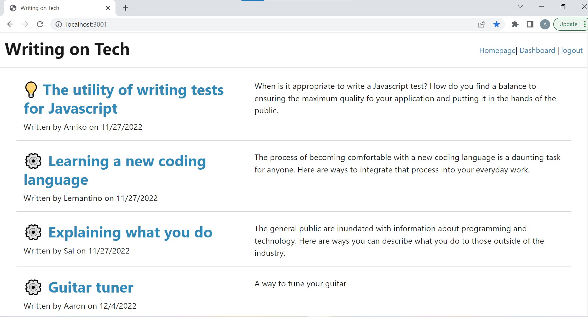
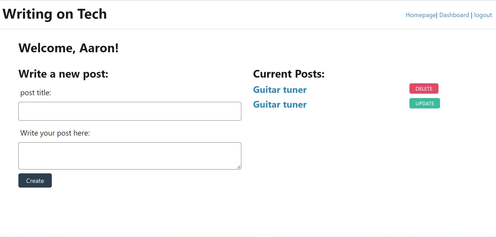
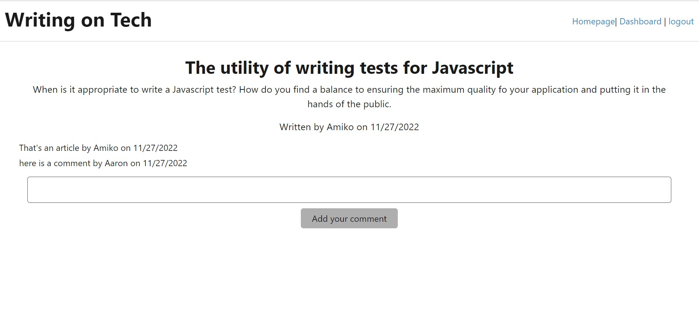

# Aaron-tech-blog

## Table of Contents

- [Description](#description)
- [Usage](#usage)
- [Installation](#installation)
- [Credits](#credits)
- [Repository](#repository)
- [Deployed Application](#deployed-application)
- [License](#license)

## Description

The tech blog is a destination for users to create blog posts to share information about computer programming as well as web and software development. The site requires the user to be logged on to use its features. The user is able to write a blog post from their dashboard. This includes a title and a body of text. Posts are then displayed on the homepage with the author and date they were created. Users are also able to post comments to the articles which will display their names and the dates the comments were added.

## Usage

The application is used to write blog posts and share them with other developers or the general public. The posts should include information about how to use programming languages and how to better learn and communicate about those topics. Users can then share their thoughts with comments. If the author wants to amend their post they can do this with an update.

## Images

## Installation

Required packages can be added by running an npm install.

## Credits

This application was created by Aaron Santowasso with assistance with code from the bootcamp curriculum. 

## Repository

The application's repository can be found at- https://github.com/Asantowasso/Aaron-tech-blog

# Deployed Application

Application has been deployed to Heroku- 

## License

Licensed under the MIT license.